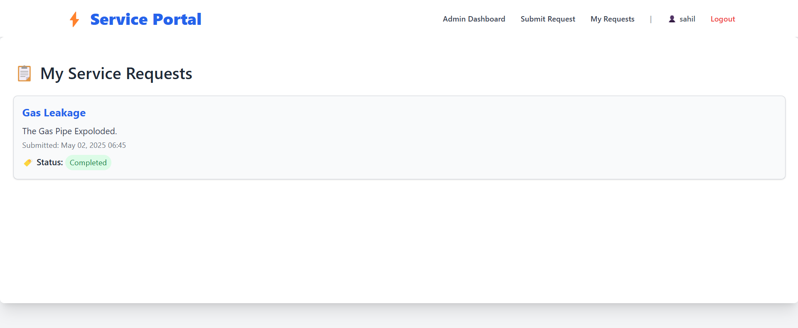
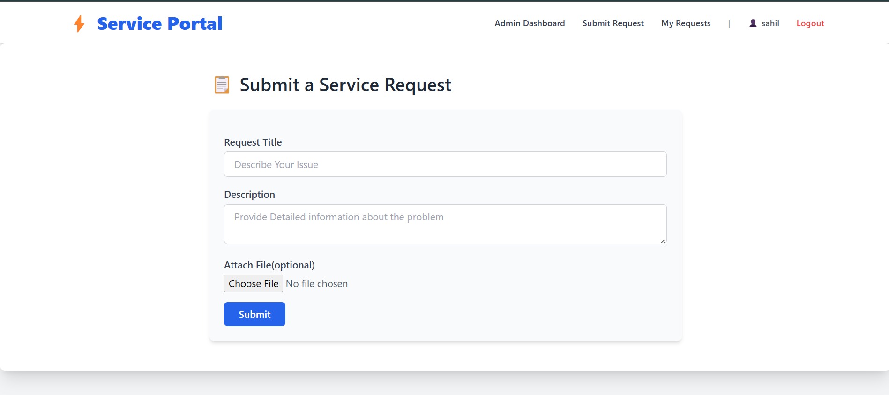

The Service Management System is a Django-based web application that allows customers to submit and track gas service requests online. It features user authentication, request tracking, an admin panel for management, and role-based access control. The system improves service efficiency, reduces wait times, and enhances customer experience for gas utility companies. 🚀🔥






Setup
Update the System
```bash
sudo apt-get update
```
To get this repository, run the following command inside your git enabled terminal

```bash
git clone https://github.com/sahilgunjal122/Service-Request-Portal.git
```
You will need django to be installed in you computer to run this app. Head over to https://www.djangoproject.com/download/ for the download guide

Download django using pip
```bash
sudo apt install python3-pip -y
```
```bash
pip install django
```
Once you have downloaded django, go to the cloned repo directory and run the following command
```bash
python3 manage.py makemigrations
```
This will create all the migrations file (database migrations) required to run this App.

Now, to apply this migrations run the following command
```bash
python3 manage.py migrate
```
One last step and then our App will be live. We need to create an admin user to run this App. On the terminal, type the following command and provide username, password and email for the admin user
```bash
python3 manage.py createsuperuser
```
Start the server by following command
```bash
python3 manage.py runserver
```
Once the server is hosted, head over to http://127.0.0.1:8000/Service-Request-Portal for the App.

Cheers and Happy Coding :)
